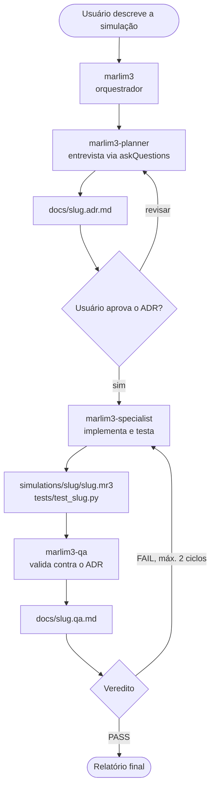
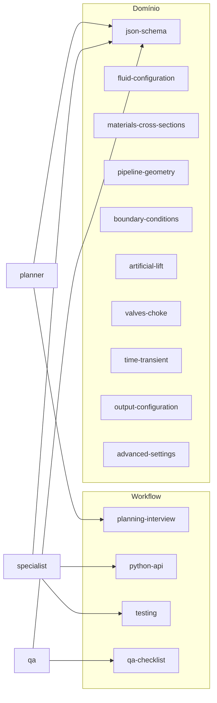

# Guia dos agentes Marlim3

Este repositório inclui um fluxo de agentes do GitHub Copilot para criar simulações Marlim3 completas: do pedido em linguagem natural até o arquivo `.mr3` testado e verificado. Você descreve a simulação, o planner entrevista você e registra tudo em um ADR, o specialist implementa e o QA valida.

## Visão geral do fluxo

## Passo a passo

1. Invoque o agente `marlim3` (ou `marlim3-planner` direto) e descreva a simulação desejada: tipo de sistema, fluidos, geometria, evento transiente etc.
2. O planner faz perguntas estruturadas em lotes (escopo, fluidos, geometria e térmica, condições de contorno e equipamentos, eventos e saídas). Tudo que você não responder vira um default registrado no ADR.
3. O planner grava o plano completo em `docs/<slug>.adr.md`, com tabela de referências cruzadas, entregáveis e critérios de aceitação. Revise e aprove.
4. O specialist lê o ADR e gera `simulations/<slug>/<slug>.mr3` (chaves em inglês, com `"language": "en"`), o script Python opcional e a suíte `tests/test_<slug>.py`, seguindo as convenções do repositório (marker `simulacao`, guarda de executável, `tmp_path`). Ele valida contra o schema e roda os testes antes de entregar.
5. O QA verifica tudo de forma independente (conformidade com o ADR, schema, referências cruzadas, consistência de arrays, plausibilidade física, execução dos testes) e grava o relatório final em `docs/<slug>.qa.md` com veredito PASS, PASS WITH WARNINGS ou FAIL.
6. Em caso de FAIL, o orquestrador devolve os achados ao specialist (no máximo 2 ciclos) e reexecuta o QA. Ao final, você recebe o resumo com todos os caminhos e resultados.

## Agentes

| Agente | Papel | Entrega |
|--------|-------|---------|
| [marlim3](agents/marlim3.agent.md) | Orquestra o pipeline e o ciclo de correção | Relatório final |
| [marlim3-planner](agents/marlim3-planner.agent.md) | Entrevista o usuário e decide a engenharia | `docs/<slug>.adr.md` |
| [marlim3-specialist](agents/marlim3-specialist.agent.md) | Implementa o ADR e escreve os testes | `simulations/<slug>/`, `tests/test_<slug>.py` |
| [marlim3-qa](agents/marlim3-qa.agent.md) | Verifica e emite o veredito | `docs/<slug>.qa.md` |

## Skills

Cada agente carrega apenas as skills relevantes ao caso. As de workflow definem o processo; as de domínio destilam a documentação oficial ([docs/user-guide/](../docs/index.md), [docs/schema_branch.json](../docs/schema_branch.json)) e apontam para os arquivos autoritativos.

| Skill | Quando é usada |
|-------|----------------|
| [marlim3-planning-interview](skills/marlim3-planning-interview/SKILL.md) | Protocolo de entrevista, defaults seguros e template do ADR |
| [marlim3-python-api](skills/marlim3-python-api/SKILL.md) | API `Branch`/`Tramo`, `simulate()`, resultados e CLI |
| [marlim3-testing](skills/marlim3-testing/SKILL.md) | Convenções de pytest do repositório e template de teste |
| [marlim3-qa-checklist](skills/marlim3-qa-checklist/SKILL.md) | Checklist de verificação e template do relatório de QA |
| [marlim3-json-schema](skills/marlim3-json-schema/SKILL.md) | Estrutura do `.mr3`, unidades, chaves EN/PT e referências cruzadas (sempre carregada) |
| [marlim3-fluid-configuration](skills/marlim3-fluid-configuration/SKILL.md) | Black-oil, tabela flash, composicional, emulsões, PVT |
| [marlim3-materials-cross-sections](skills/marlim3-materials-cross-sections/SKILL.md) | Materiais, camadas radiais, formação rochosa |
| [marlim3-pipeline-geometry](skills/marlim3-pipeline-geometry/SKILL.md) | Segmentos, ângulos ou modo XY, discretização, acoplamento térmico |
| [marlim3-boundary-conditions](skills/marlim3-boundary-conditions/SKILL.md) | IPR, fontes, separador, gasInj, poço injetor |
| [marlim3-artificial-lift](skills/marlim3-artificial-lift/SKILL.md) | Gas lift, BCS/ESP, bombas, descarga de anular |
| [marlim3-valves-choke](skills/marlim3-valves-choke/SKILL.md) | Válvulas, chokes, PIG, vazamentos, parada e repartida |
| [marlim3-time-transient](skills/marlim3-time-transient/SKILL.md) | Modo transiente, condição inicial, cronograma de passos, snapshots |
| [marlim3-output-configuration](skills/marlim3-output-configuration/SKILL.md) | Perfis, tendências, saídas radiais e DataFrames de resultado |
| [marlim3-advanced-settings](skills/marlim3-advanced-settings/SKILL.md) | Ajustes numéricos, desempenho, parafina, difusão 3D |

## Dicas

- Para só planejar (sem implementar), chame `marlim3-planner` diretamente. Para implementar um ADR já aprovado, chame `marlim3-specialist` passando o caminho do ADR. Para auditar um caso existente, chame `marlim3-qa`.
- Os testes com marker `simulacao` exigem o executável compilado e são pulados automaticamente sem ele (veja [tests/README.md](../tests/README.md)). Teste pulado não é teste aprovado.
- Rode um caso pronto com `uv run pytest tests/test_<slug>.py -v` ou via `marlim3.Branch().from_json(...)`.
